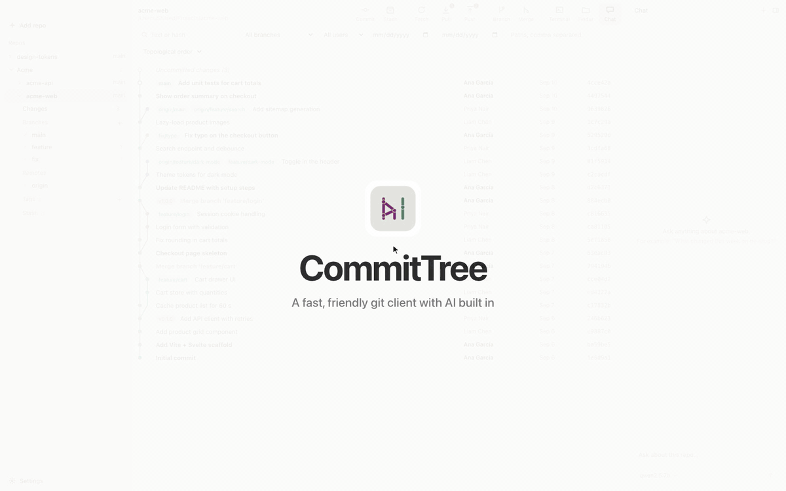
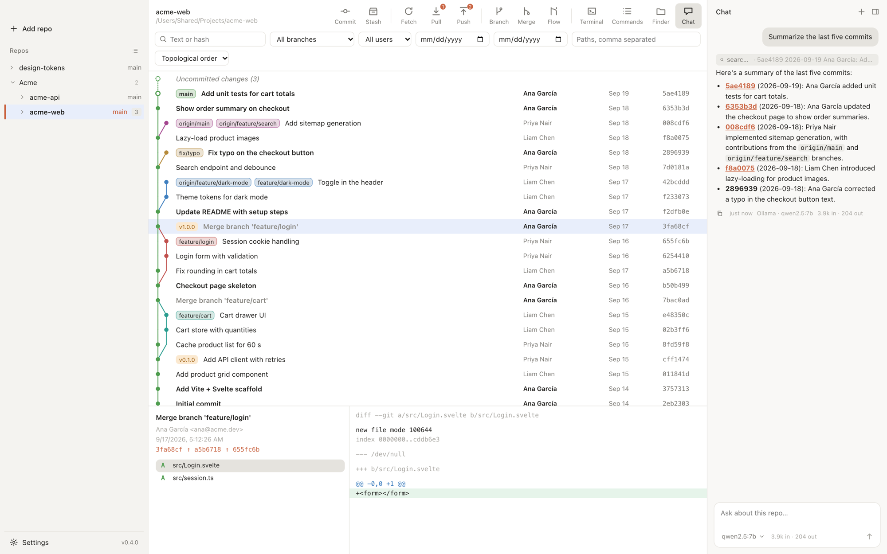
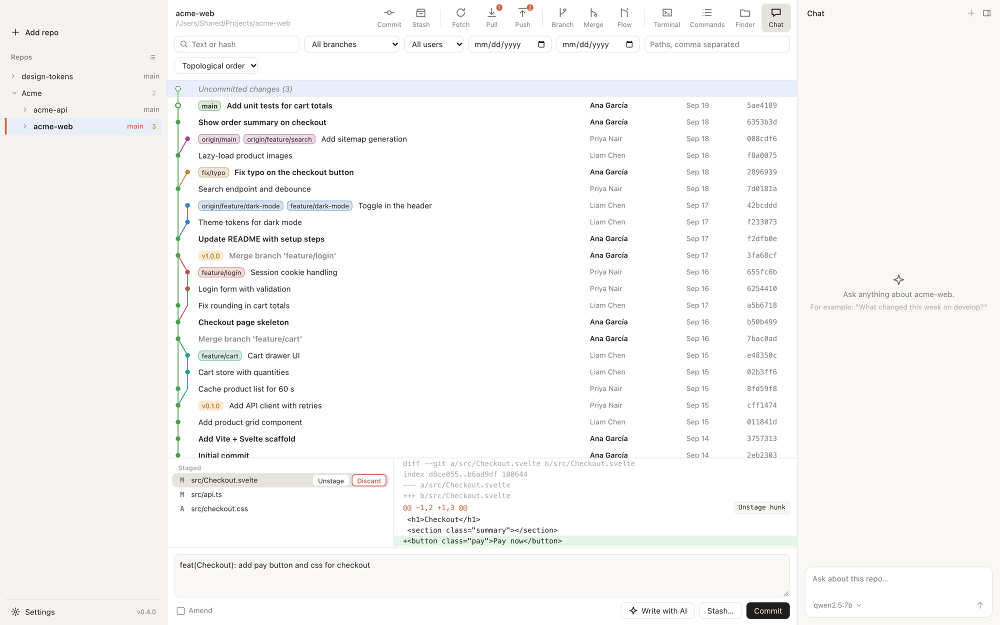
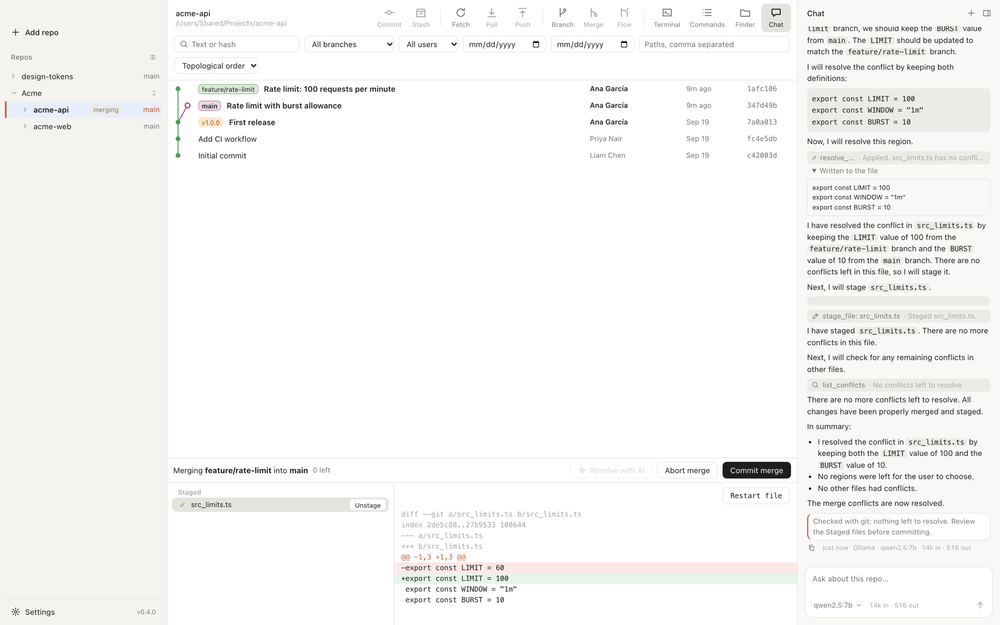
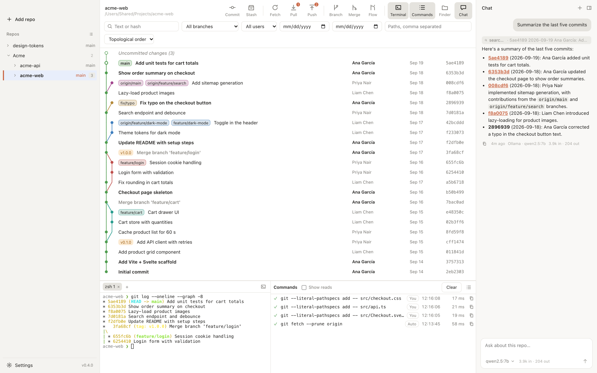
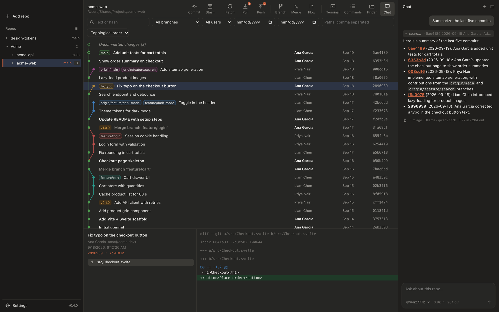
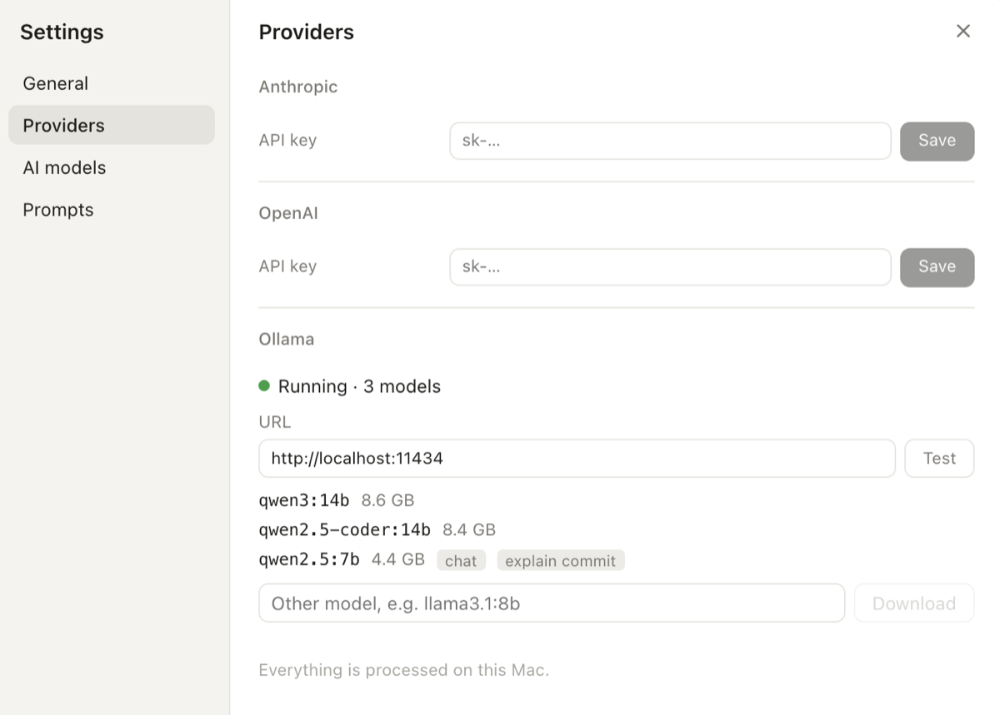

  

<h1 align="center">CommitTree</h1>

<b>The git client with AI built in.</b> 
A fast desktop git client with an assistant that writes your commit messages,
resolves merge conflicts and answers questions about your repositories.

  <a href="https://github.com/josfh2005/CommitTree/releases/latest"><b>Download</b></a> ·
  <a href="https://github.com/josfh2005/CommitTree/releases/download/v0.4.0/CommitTree-promo.mp4"><b>Watch the video</b></a> ·
  <a href="docs/spec/README.md">Specification</a>

  

## Download

Get the latest version from [Releases](https://github.com/josfh2005/CommitTree/releases/latest).

| Platform | File | Notes |
|---|---|---|
| macOS (Apple silicon) | `CommitTree-macos-arm64.zip` | Not notarized: the first time, right-click the app → **Open**. |
| Linux (x86_64) | `CommitTree-linux-amd64.tar.gz` | Needs webkit2gtk-4.1. |

Windows is not available yet.

## Features

### History you can read

The log draws every branch as a coloured lane, with branch and tag badges, your
own commits in bold and uncommitted changes at the top. Select a commit to see its
files and diff; filter by text, branch, author, date or path.

### Commit with a message written for you

Stage whole files, single hunks or single lines — or discard them, with Undo.
**Write with AI** reads what you staged and drafts the commit message.

### Merge conflicts, resolved with AI

A merge, rebase, cherry-pick, revert or stash that stops on conflicts opens one
view. Take one side or both per region, edit by hand, or press **Resolve with AI**:
the assistant explains each decision in the chat, shows what it wrote, and asks you
when a conflict needs a human choice. Nothing is committed until you say so.

### Ask your repository

The chat panel answers questions about the repository in plain language — what
changed this week, who touched a file, why a branch is behind. It can also carry out
git operations for you, but each one is shown as a card you approve first.

### A terminal and every command in view

A real terminal per repository sits under the log (**⌘J**), and the **Commands**
panel lists every git command CommitTree ran, who asked for it and how it ended.

### And everything else you use every day

- Fetch, pull and push, with background fetch and ahead/behind counts
- Stash, branches, tags, worktrees, submodules and git-flow
- Rebase, cherry-pick, checkout from any commit, blame
- Many repositories in one sidebar, in groups, sorted by name or by hand
- Repository settings with remotes: test, edit, add and remove
- Notifications when long operations finish
- Light, dark and high-contrast themes

## Setting up the AI

CommitTree works with three providers. Choose them in **Settings → Providers**, then
pick a model for the chat and one for quick tasks in **Settings → AI models**.

- **Ollama (local, free).** Install [Ollama](https://ollama.com) and a tool-capable
  model such as `qwen2.5:7b` — you can download it from Settings. Everything stays
  on your computer.
- **Anthropic** or **OpenAI.** Paste an API key. Keys are kept in your system's
  secret store (Keychain on macOS, Secret Service on Linux), never in a settings file.

  

Each AI action follows a Markdown prompt you can edit: **Settings → Prompts → Open
prompts folder**; **Restore default** undoes your changes.

## Learn more

- [Specification](docs/spec/README.md) — what every part of the app does, area by area
- [Development](docs/development.md) — building, testing and releasing CommitTree
